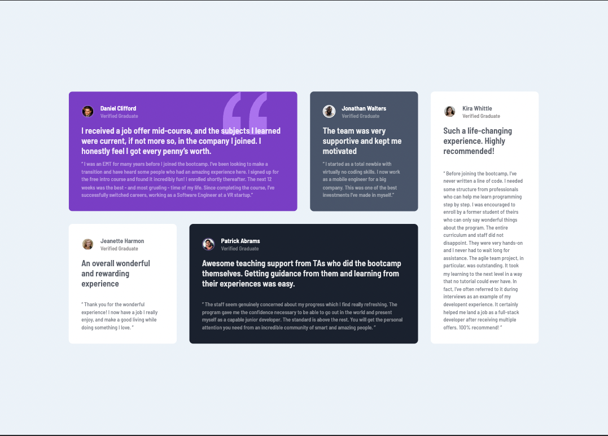

# Frontend Mentor - Testimonials Grid Section

---

## Table of Content

* [Useful Links](#useful-links)
* [Mobile version](#mobile)
* [Desktop version](#desktop)

---

### Useful Links 

* [FM - Testimonials Grid Section](https://www.frontendmentor.io/challenges/testimonials-grid-section-Nnw6J7Un7)

* [Vercel: My Solution](https://fm-11-testimonials-grid-section.vercel.app/)

--- 
### Mobile version 

--- 
### Desktop version 

